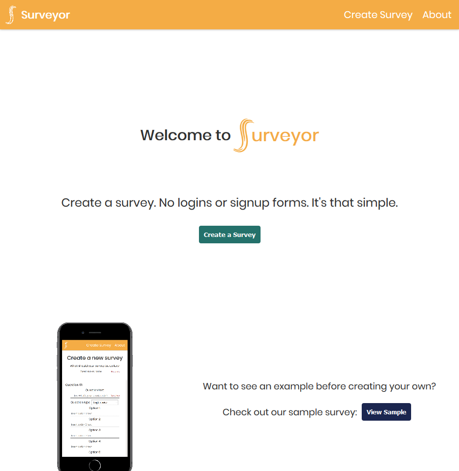
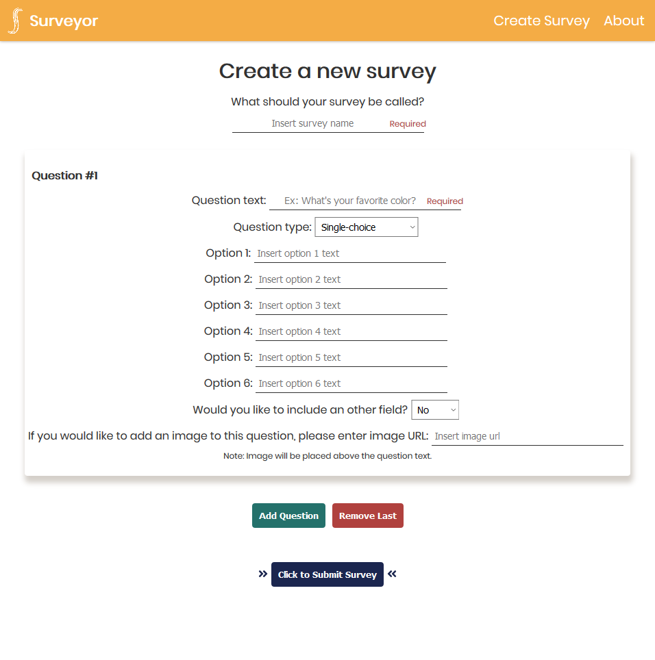
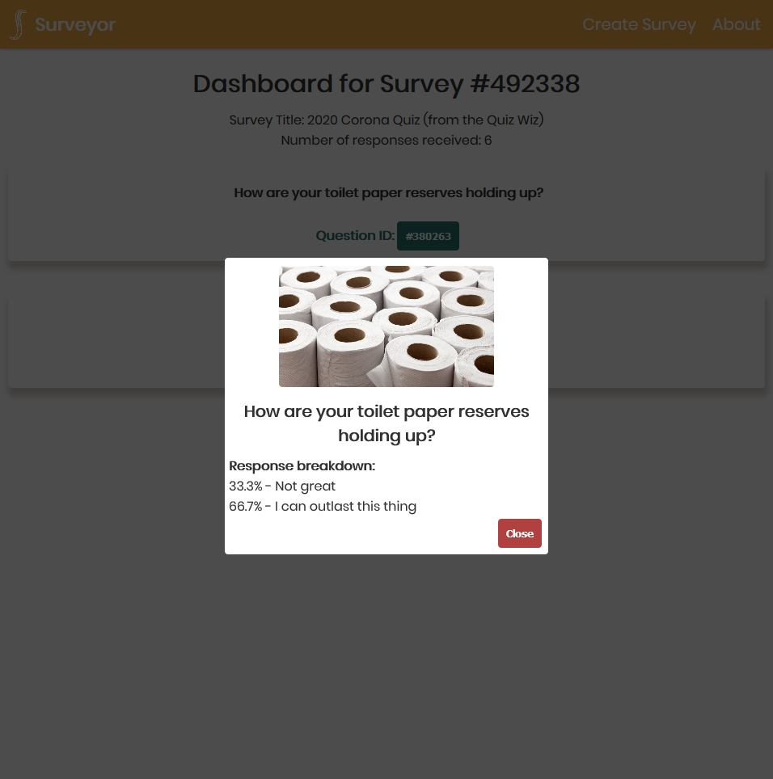

# Surveyor

## Summary

Surveyor is a full stack solo project using the PERN stack
(PostgreSQL, Express.js, React, Node.js). It is powered by a React
frontend and a backend API server running via Express. Project goal
was to create a survey app allowing for surveys to be quickly deployed
and shared with no login necessary, while still providing user convenience and
basic survey analytics.

Demo for this app is
located at [surveyor.karleypetracca.com](http://surveyor.karleypetracca.com)

The repo for the API can be viewed on [GitHub](https://github.com/karleypetracca/surveyor-api)
or as a demo site at
[surveyor-api.karleypetracca.com](http://surveyor-api.karleypetracca.com)

## Tools used:

- Create React App
- styled-components
- Font Awesome for React (aka Fort Awesome)

## Screenshots





## Features

Surveyor was built using React and functional components, requiring use of the newer
React hook features such as useState, useEffect and useRef. Other than the base
set up CSS, majority of styling was done within components using
styled-components. The App gets and posts data to populate the
site via the Surveyor API which is then connected to a PostgreSQL database.

Future features could include an option to save surveys via user login, advanced
analytics and more
logic on survey
question types. For example, currently the question type does not alter how the question is
filled out but the backend is ready to support the feature.

## Installation

### Clone

- Clone this repo to your local machine

### Setup

- Install npm packages

```
$ npm i
```

- Run program

```
$ npm start
```

## Image sources:

- [Site logo](https://favicon.io/)
- [Mobile Mock-up](https://mockuphone.com/#ios)

## Authors:

- Karley Petracca - [GitHub](https://github.com/karleypetracca)
